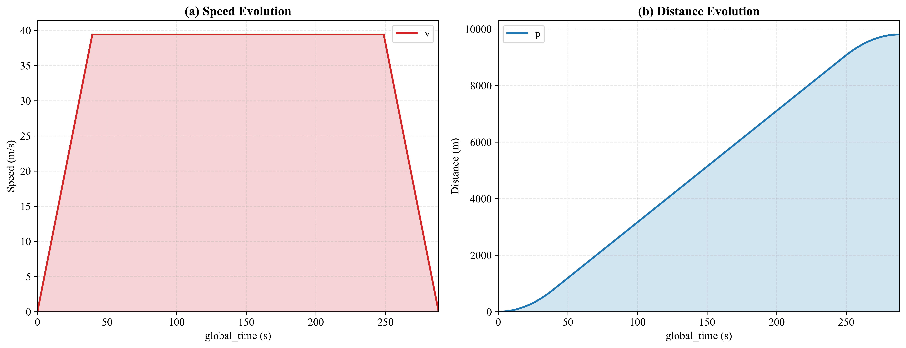

# Analysis and Verification of Mobile and Cyber-Physical Extensions to Sequence Diagrams in the Hybrid $\pi$-Calculus
This project implements a tool for automatically translating Extended Sequence Diagrams (ESD) into Hybrid $\pi$-Calculus (HpC) processes, enabling modeling, simulation, and analysis. The tool supports formal modeling of complex discrete-continuous hybrid systems, process standardization, automated simulation, and trajectory visualization. 

## File Structure

| File | Description |
|------|-------------|
| `README.md` | Project documentation |
| `esd.py` | Core module for ESD parsing and HpC process generation |
| `hpc.py` | Syntax structure definition for Hybrid $\pi$-Calculus |
| `expr.py` | Expression evaluation module supporting variables, constants, binary operations (e.g., `+`, `-`, `*`, `/`), and unary operations (e.g., `¬` for logical negation) |
| `standardize_process.py` | Standardization of HpC processes and variable conflict resolution |
| `simulator.py` | Discrete-continuous hybrid simulation engine |
| `sim_test.py` | Batch automation testing script for multiple cases |
| `simulatorplot.py` | Automated trajectory plotting and statistical analysis |
| `example/` | Directory for batch case inputs and outputs |

## Usage

1. Prepare the input file `example.txt` following the specified sequence diagram format.
2. Run the main script `esd.py`:
   ```bash
   python esd.py
   ```
3. View the translation results:
   - Console output
   - The generated `example_translated_output.txt` file (HpC process with syntactic sugar)
   - The generated `example_standardized_output.txt` file (standardized HpC processes)
4. Run the simulation script `simulator.py`:
   ```bash
   python simulator.py
   ```
   This generates the following simulation outputs:
   - `example_simulation_events.txt` – Simulation event log
   - `example_steps.txt` – Reduction step log
   - `example_trace.txt` – Continuous evolution trajectory file
5. Visualize the trajectories. Run the visualization script `simulatorplot.py`:
   ```bash
   python simulatorplot.py
   ```
   This produces a variable evolution plot, as shown below:

6. Run batch tests. Execute the batch testing script `sim_test.py`:
   ```bash
   python sim_test.py
   ```
   This automatically processes multiple case files in the `example/` directory.

## Example

Input (`example.txt`):
```
@startuml
Train -> Train: terminus := 10000
LeftSector -> LeftSector: handover_point := 4000
LeftSector -> LeftSector: endpoint := 5000
RightSector -> RightSector: handover_point := 9000
RightSector -> RightSector: endpoint := 10000
activate Train
note over of Train: <<ode>> {0, 0, 0 | p_dot=v, v_dot=a, a_dot=0 & p<terminus and v>=0}
LeftSector -> Train: <<sense>> p0 := p
loop [1] LeftSector: p0 < handover_point
  LeftSector -> Train: <<sense>> v0 := v
  LeftSector -> LeftSector: a0 := f(p0, v0, endpoint)
  LeftSector -> Train: <<actuate>> a := a0
  activate LeftSector
  note right of LeftSector: delay(1)
  deactivate LeftSector
  LeftSector -> Train: <<sense>> p0 := p
end
LeftSector -> RightSector: handover
RightSector -> LeftSector: yes
LeftSector -> RightSector: channels(p1, v1, a1 := p, v, a)
RightSector -> Train: <<sense>> p0 := p1
loop [2] RightSector: p0 < handover_point
  RightSector -> Train: <<sense>> v0 := v1
  RightSector -> RightSector: a0 := f(p0, v0, endpoint)
  RightSector -> Train: <<actuate>> a1 := a0
  activate RightSector
  note left of RightSector: delay(1)
  deactivate RightSector
  RightSector -> Train: <<sense>> p0 := p1
end
RightSector -> Train: <<actuate>> a1 := -1
deactivate Train
@enduml
```

Translated output (`example_translated_output.txt`):
```
Train ::= ⟨terminus:=10000⟩.{0, 0, 0 | p_dot=v, v_dot=a, a_dot=0 & p<terminus and v>=0, {p̅, v̅, a}}.0 || LeftSector ::= ⟨handover_point_1:=4000⟩.⟨endpoint_1:=5000⟩.p(p0).(ν loop[1]) loop[1]⟨p0, handover_point_1⟩.0 || !loop[1](p0, handover_point_1).([p0 < handover_point_1].v(v0).⟨a0_1:=f(p0, v0, endpoint_1)⟩.a̅⟨a0_1⟩.(ν t) {0 | t_dot=1 & t<1.0, {}}.p(p0).loop[1]⟨p0, handover_point_1⟩.0 + [(¬p0 < handover_point_1)].handover̅⟨⟩.yes().channels̅⟨p, v, a⟩.0) || RightSector ::= ⟨handover_point_2:=9000⟩.⟨endpoint_2:=10000⟩.handover().yes̅⟨⟩.channels(p1, v1, a1).p1(p0).(ν loop[2]) loop[2]⟨p0, handover_point_2⟩.0 || !loop[2](p0, handover_point_2).([p0 < handover_point_2].v1(v0).⟨a0_2:=f(p0, v0, endpoint_2)⟩.a1̅⟨a0_2⟩.(ν t) {0 | t_dot=1 & t<1.0, {}}.p1(p0).loop[2]⟨p0, handover_point_2⟩.0 + [(¬p0 < handover_point_2)].a1̅⟨-1⟩.0)
```

Standardized output (`example_standardized_output.txt`):
```
Train ::= ⟨terminus:=10000⟩.{0, 0, 0 | p_dot=v, v_dot=a, a_dot=0 & p<terminus and v>=0, {p̅, v̅, a}}.0
LeftSector ::= ⟨handover_point_1:=4000⟩.⟨endpoint_1:=5000⟩.p(p0).loop[1]⟨p0, handover_point_1⟩.0
Replication 1 ::= !loop[1](p0, handover_point_1).([p0 < handover_point_1].v(v0).⟨a0_1:=f(p0, v0, endpoint_1)⟩.a̅⟨a0_1⟩.{0 | t_dot=1 & t<1.0, {}}.p(p0).loop[1]⟨p0, handover_point_1⟩.0 + [(¬p0 < handover_point_1)].handover̅⟨⟩.yes().channels̅⟨p, v, a⟩.0)
RightSector ::= ⟨handover_point_2:=9000⟩.⟨endpoint_2:=10000⟩.handover().yes̅⟨⟩.channels(p1, v1, a1).p1(p0).loop[2]⟨p0, handover_point_2⟩.0
Replication 2 ::= !loop[2](p0, handover_point_2).([p0 < handover_point_2].v1(v0).⟨a0_2:=f(p0, v0, endpoint_2)⟩.a1̅⟨a0_2⟩.{0 | t'_dot=1 & t'<1.0, {}}.p1(p0).loop[2]⟨p0, handover_point_2⟩.0 + [(¬p0 < handover_point_2)].a1̅⟨-1⟩.0)
System ::= (ν loop[1]) (ν loop[2]) (ν t) (ν t') Train || LeftSector || Replication 1 || RightSector || Replication 2
```

Events logs (`example_simulation_events.txt`):
```
# HpC simulation event log
=== Starting HPC continuous process simulation ===
Collected named definition[0]: Train
Collected named definition[1]: LeftSector
Collected named definition[2]: Replication 1
Collected named definition[3]: RightSector
Collected named definition[4]: Replication 2
Collected named definition[5]: System
Removing restriction: ['loop[1]']
Removing restriction: ['loop[2]']
Removing restriction: ['t']
Removing restriction: ["t'"]
Protecting Sum process during canonical form conversion
Protecting Sum process during canonical form conversion

--- Step 1 ---
ASSIGN expansion: idx=0, var=terminus, expr=10000, fresh=terminus'
ASSIGN expansion: idx=1, var=handover_point_2, expr=4000, fresh=handover_point_2'
ASSIGN expansion: idx=2, var=handover_point_1, expr=9000, fresh=handover_point_1'
Protecting Sum process during canonical form conversion
Protecting Sum process during canonical form conversion
Attempted to apply [Assign-Expand] rule: applied=True, new_proc=terminus'⟨10000⟩.terminus'(terminus).{0, 0, 0 | p_dot=v, v_dot=a, a_dot=0 & p<terminus and v>=0, {p̅, v̅, a}}.0 || terminus'(y).terminus'⟨y⟩.0 || handover_point_2'⟨4000⟩.handover_point_2'(handover_point_2).⟨endpoint_2:=5000⟩.p(p0).loop[1]⟨p0, handover_point_2⟩.0 || handover_point_2'(y).handover_point_2'⟨y⟩.0 || handover_point_1'⟨9000⟩.handover_point_1'(handover_point_1).⟨endpoint_1:=10000⟩.handover().yes̅⟨⟩.channels(p1, v1, a1).p1(p0).loop[2]⟨p0, handover_point_1⟩.0 || handover_point_1'(y).handover_point_1'⟨y⟩.0 || !loop[1](p0, handover_point_2).([p0 < handover_point_2].v(v0).⟨a0_2:=f(p0, v0, endpoint_2)⟩.a̅⟨a0_2⟩.{0 | t_dot=1 & t<1.0, {}}.p(p0).loop[1]⟨p0, handover_point_2⟩.0 + [(¬p0 < handover_point_2)].handover̅⟨⟩.yes().channels̅⟨p, v, a⟩.0) || !loop[2](p0, handover_point_1).([p0 < handover_point_1].v1(v0).⟨a0_1:=f(p0, v0, endpoint_1)⟩.a1̅⟨a0_1⟩.{0 | t'_dot=1 & t'<1.0, {}}.p1(p0).loop[2]⟨p0, handover_point_1⟩.0 + [(¬p0 < handover_point_1)].a1̅⟨-1⟩.0), log=terminus:=10000 via terminus'; handover_point_2:=4000 via handover_point_2'; handover_point_1:=9000 via handover_point_1'
Discrete reduction: Applied [Assign-Expand] rule (terminus:=10000 via terminus'; handover_point_2:=4000 via handover_point_2'; handover_point_1:=9000 via handover_point_1')
Check process termination: terminus'⟨10000⟩.terminus'(terminus).{0, 0, 0 | p_dot=v, v_dot=a, a_dot=0 & p<terminus and v>=0, {p̅, v̅, a}}.0 || terminus'(y).terminus'⟨y⟩.0 || handover_point_2'⟨4000⟩.handover_point_2'(handover_point_2).⟨endpoint_2:=5000⟩.p(p0).loop[1]⟨p0, handover_point_2⟩.0 || handover_point_2'(y).handover_point_2'⟨y⟩.0 || handover_point_1'⟨9000⟩.handover_point_1'(handover_point_1).⟨endpoint_1:=10000⟩.handover().yes̅⟨⟩.channels(p1, v1, a1).p1(p0).loop[2]⟨p0, handover_point_1⟩.0 || handover_point_1'(y).handover_point_1'⟨y⟩.0 || !loop[1](p0, handover_point_2).([p0 < handover_point_2].v(v0).⟨a0_2:=f(p0, v0, endpoint_2)⟩.a̅⟨a0_2⟩.{0 | t_dot=1 & t<1.0, {}}.p(p0).loop[1]⟨p0, handover_point_2⟩.0 + [(¬p0 < handover_point_2)].handover̅⟨⟩.yes().channels̅⟨p, v, a⟩.0) || !loop[2](p0, handover_point_1).([p0 < handover_point_1].v1(v0).⟨a0_1:=f(p0, v0, endpoint_1)⟩.a1̅⟨a0_1⟩.{0 | t'_dot=1 & t'<1.0, {}}.p1(p0).loop[2]⟨p0, handover_point_1⟩.0 + [(¬p0 < handover_point_1)].a1̅⟨-1⟩.0)

--- Step 2 ---
Attempted to apply [Assign-Expand] rule: applied=False, new_proc=terminus'⟨10000⟩.terminus'(terminus).{0, 0, 0 | p_dot=v, v_dot=a, a_dot=0 & p<terminus and v>=0, {p̅, v̅, a}}.0 || terminus'(y).terminus'⟨y⟩.0 || handover_point_2'⟨4000⟩.handover_point_2'(handover_point_2).⟨endpoint_2:=5000⟩.p(p0).loop[1]⟨p0, handover_point_2⟩.0 || handover_point_2'(y).handover_point_2'⟨y⟩.0 || handover_point_1'⟨9000⟩.handover_point_1'(handover_point_1).⟨endpoint_1:=10000⟩.handover().yes̅⟨⟩.channels(p1, v1, a1).p1(p0).loop[2]⟨p0, handover_point_1⟩.0 || handover_point_1'(y).handover_point_1'⟨y⟩.0 || !loop[1](p0, handover_point_2).([p0 < handover_point_2].v(v0).⟨a0_2:=f(p0, v0, endpoint_2)⟩.a̅⟨a0_2⟩.{0 | t_dot=1 & t<1.0, {}}.p(p0).loop[1]⟨p0, handover_point_2⟩.0 + [(¬p0 < handover_point_2)].handover̅⟨⟩.yes().channels̅⟨p, v, a⟩.0) || !loop[2](p0, handover_point_1).([p0 < handover_point_1].v1(v0).⟨a0_1:=f(p0, v0, endpoint_1)⟩.a1̅⟨a0_1⟩.{0 | t'_dot=1 & t'<1.0, {}}.p1(p0).loop[2]⟨p0, handover_point_1⟩.0 + [(¬p0 < handover_point_1)].a1̅⟨-1⟩.0), log=None
Attempted to apply [Pass] rule: applied=False, new_proc=terminus'⟨10000⟩.terminus'(terminus).{0, 0, 0 | p_dot=v, v_dot=a, a_dot=0 & p<terminus and v>=0, {p̅, v̅, a}}.0 || terminus'(y).terminus'⟨y⟩.0 || handover_point_2'⟨4000⟩.handover_point_2'(handover_point_2).⟨endpoint_2:=5000⟩.p(p0).loop[1]⟨p0, handover_point_2⟩.0 || handover_point_2'(y).handover_point_2'⟨y⟩.0 || handover_point_1'⟨9000⟩.handover_point_1'(handover_point_1).⟨endpoint_1:=10000⟩.handover().yes̅⟨⟩.channels(p1, v1, a1).p1(p0).loop[2]⟨p0, handover_point_1⟩.0 || handover_point_1'(y).handover_point_1'⟨y⟩.0 || !loop[1](p0, handover_point_2).([p0 < handover_point_2].v(v0).⟨a0_2:=f(p0, v0, endpoint_2)⟩.a̅⟨a0_2⟩.{0 | t_dot=1 & t<1.0, {}}.p(p0).loop[1]⟨p0, handover_point_2⟩.0 + [(¬p0 < handover_point_2)].handover̅⟨⟩.yes().channels̅⟨p, v, a⟩.0) || !loop[2](p0, handover_point_1).([p0 < handover_point_1].v1(v0).⟨a0_1:=f(p0, v0, endpoint_1)⟩.a1̅⟨a0_1⟩.{0 | t'_dot=1 & t'<1.0, {}}.p1(p0).loop[2]⟨p0, handover_point_1⟩.0 + [(¬p0 < handover_point_1)].a1̅⟨-1⟩.0), log=None
Attempted to apply [Stop] rule: applied=False, new_proc=terminus'⟨10000⟩.terminus'(terminus).{0, 0, 0 | p_dot=v, v_dot=a, a_dot=0 & p<terminus and v>=0, {p̅, v̅, a}}.0 || terminus'(y).terminus'⟨y⟩.0 || handover_point_2'⟨4000⟩.handover_point_2'(handover_point_2).⟨endpoint_2:=5000⟩.p(p0).loop[1]⟨p0, handover_point_2⟩.0 || handover_point_2'(y).handover_point_2'⟨y⟩.0 || handover_point_1'⟨9000⟩.handover_point_1'(handover_point_1).⟨endpoint_1:=10000⟩.handover().yes̅⟨⟩.channels(p1, v1, a1).p1(p0).loop[2]⟨p0, handover_point_1⟩.0 || handover_point_1'(y).handover_point_1'⟨y⟩.0 || !loop[1](p0, handover_point_2).([p0 < handover_point_2].v(v0).⟨a0_2:=f(p0, v0, endpoint_2)⟩.a̅⟨a0_2⟩.{0 | t_dot=1 & t<1.0, {}}.p(p0).loop[1]⟨p0, handover_point_2⟩.0 + [(¬p0 < handover_point_2)].handover̅⟨⟩.yes().channels̅⟨p, v, a⟩.0) || !loop[2](p0, handover_point_1).([p0 < handover_point_1].v1(v0).⟨a0_1:=f(p0, v0, endpoint_1)⟩.a1̅⟨a0_1⟩.{0 | t'_dot=1 & t'<1.0, {}}.p1(p0).loop[2]⟨p0, handover_point_1⟩.0 + [(¬p0 < handover_point_1)].a1̅⟨-1⟩.0), log=None
input process: 3,[(1, <hpc.PrefixProcess object at 0x0000024B8F5AFBE0>, <hpc.PrefixProcess object at 0x0000024B8F5AFBE0>, False, -1), (3, <hpc.PrefixProcess object at 0x0000024B8F5AFE80>, <hpc.PrefixProcess object at 0x0000024B8F5AFE80>, False, -1), (5, <hpc.PrefixProcess object at 0x0000024B8F5B8280>, <hpc.PrefixProcess object at 0x0000024B8F5B8280>, False, -1)]，output process: 3,[(0, <hpc.PrefixProcess object at 0x0000024B8F5AF130>, <hpc.PrefixProcess object at 0x0000024B8F5AF130>, False, -1), (2, <hpc.PrefixProcess object at 0x0000024B8F5AFDC0>, <hpc.PrefixProcess object at 0x0000024B8F5AFDC0>, False, -1), (4, <hpc.PrefixProcess object at 0x0000024B8F5B81C0>, <hpc.PrefixProcess object at 0x0000024B8F5B81C0>, False, -1)]
output variable list: [<expr.Var object at 0x0000024B8F58F940>]
evaluate output expression: 10000 -> val=10000, missing=set()
communication injection: terminus = 10000
output expression evaluation result: valid=True, values=[10000]
Protecting Sum process during canonical form conversion
Protecting Sum process during canonical form conversion
COMM consumption: out_idx=0 in_idx=1 channel=terminus values=[10000]
Attempted to apply [Comm] rule: applied=True, new_proc=terminus'(terminus).{0, 0, 0 | p_dot=v, v_dot=a, a_dot=0 & p<terminus and v>=0, {p̅, v̅, a}}.0 || terminus'⟨10000⟩.0 || handover_point_2'⟨4000⟩.handover_point_2'(handover_point_2).⟨endpoint_2:=5000⟩.p(p0).loop[1]⟨p0, handover_point_2⟩.0 || handover_point_2'(y).handover_point_2'⟨y⟩.0 || handover_point_1'⟨9000⟩.handover_point_1'(handover_point_1).⟨endpoint_1:=10000⟩.handover().yes̅⟨⟩.channels(p1, v1, a1).p1(p0).loop[2]⟨p0, handover_point_1⟩.0 || handover_point_1'(y).handover_point_1'⟨y⟩.0 || !loop[1](p0, handover_point_2).([p0 < handover_point_2].v(v0).⟨a0_2:=f(p0, v0, endpoint_2)⟩.a̅⟨a0_2⟩.{0 | t_dot=1 & t<1.0, {}}.p(p0).loop[1]⟨p0, handover_point_2⟩.0 + [(¬p0 < handover_point_2)].handover̅⟨⟩.yes().channels̅⟨p, v, a⟩.0) || !loop[2](p0, handover_point_1).([p0 < handover_point_1].v1(v0).⟨a0_1:=f(p0, v0, endpoint_1)⟩.a1̅⟨a0_1⟩.{0 | t'_dot=1 & t'<1.0, {}}.p1(p0).loop[2]⟨p0, handover_point_1⟩.0 + [(¬p0 < handover_point_1)].a1̅⟨-1⟩.0), log=Communication channel(terminus')(Communication message: 10000)
Discrete reduction: Applied [Comm] rule (Communication channel(terminus')(Communication message: 10000))
Check process termination: terminus'(terminus).{0, 0, 0 | p_dot=v, v_dot=a, a_dot=0 & p<terminus and v>=0, {p̅, v̅, a}}.0 || terminus'⟨10000⟩.0 || handover_point_2'⟨4000⟩.handover_point_2'(handover_point_2).⟨endpoint_2:=5000⟩.p(p0).loop[1]⟨p0, handover_point_2⟩.0 || handover_point_2'(y).handover_point_2'⟨y⟩.0 || handover_point_1'⟨9000⟩.handover_point_1'(handover_point_1).⟨endpoint_1:=10000⟩.handover().yes̅⟨⟩.channels(p1, v1, a1).p1(p0).loop[2]⟨p0, handover_point_1⟩.0 || handover_point_1'(y).handover_point_1'⟨y⟩.0 || !loop[1](p0, handover_point_2).([p0 < handover_point_2].v(v0).⟨a0_2:=f(p0, v0, endpoint_2)⟩.a̅⟨a0_2⟩.{0 | t_dot=1 & t<1.0, {}}.p(p0).loop[1]⟨p0, handover_point_2⟩.0 + [(¬p0 < handover_point_2)].handover̅⟨⟩.yes().channels̅⟨p, v, a⟩.0) || !loop[2](p0, handover_point_1).([p0 < handover_point_1].v1(v0).⟨a0_1:=f(p0, v0, endpoint_1)⟩.a1̅⟨a0_1⟩.{0 | t'_dot=1 & t'<1.0, {}}.p1(p0).loop[2]⟨p0, handover_point_1⟩.0 + [(¬p0 < handover_point_1)].a1̅⟨-1⟩.0)

--- Step 3 ---
Attempted to apply [Assign-Expand] rule: applied=False, new_proc=terminus'(terminus).{0, 0, 0 | p_dot=v, v_dot=a, a_dot=0 & p<terminus and v>=0, {p̅, v̅, a}}.0 || terminus'⟨10000⟩.0 || handover_point_2'⟨4000⟩.handover_point_2'(handover_point_2).⟨endpoint_2:=5000⟩.p(p0).loop[1]⟨p0, handover_point_2⟩.0 || handover_point_2'(y).handover_point_2'⟨y⟩.0 || handover_point_1'⟨9000⟩.handover_point_1'(handover_point_1).⟨endpoint_1:=10000⟩.handover().yes̅⟨⟩.channels(p1, v1, a1).p1(p0).loop[2]⟨p0, handover_point_1⟩.0 || handover_point_1'(y).handover_point_1'⟨y⟩.0 || !loop[1](p0, handover_point_2).([p0 < handover_point_2].v(v0).⟨a0_2:=f(p0, v0, endpoint_2)⟩.a̅⟨a0_2⟩.{0 | t_dot=1 & t<1.0, {}}.p(p0).loop[1]⟨p0, handover_point_2⟩.0 + [(¬p0 < handover_point_2)].handover̅⟨⟩.yes().channels̅⟨p, v, a⟩.0) || !loop[2](p0, handover_point_1).([p0 < handover_point_1].v1(v0).⟨a0_1:=f(p0, v0, endpoint_1)⟩.a1̅⟨a0_1⟩.{0 | t'_dot=1 & t'<1.0, {}}.p1(p0).loop[2]⟨p0, handover_point_1⟩.0 + [(¬p0 < handover_point_1)].a1̅⟨-1⟩.0), log=None
Attempted to apply [Pass] rule: applied=False, new_proc=terminus'(terminus).{0, 0, 0 | p_dot=v, v_dot=a, a_dot=0 & p<terminus and v>=0, {p̅, v̅, a}}.0 || terminus'⟨10000⟩.0 || handover_point_2'⟨4000⟩.handover_point_2'(handover_point_2).⟨endpoint_2:=5000⟩.p(p0).loop[1]⟨p0, handover_point_2⟩.0 || handover_point_2'(y).handover_point_2'⟨y⟩.0 || handover_point_1'⟨9000⟩.handover_point_1'(handover_point_1).⟨endpoint_1:=10000⟩.handover().yes̅⟨⟩.channels(p1, v1, a1).p1(p0).loop[2]⟨p0, handover_point_1⟩.0 || handover_point_1'(y).handover_point_1'⟨y⟩.0 || !loop[1](p0, handover_point_2).([p0 < handover_point_2].v(v0).⟨a0_2:=f(p0, v0, endpoint_2)⟩.a̅⟨a0_2⟩.{0 | t_dot=1 & t<1.0, {}}.p(p0).loop[1]⟨p0, handover_point_2⟩.0 + [(¬p0 < handover_point_2)].handover̅⟨⟩.yes().channels̅⟨p, v, a⟩.0) || !loop[2](p0, handover_point_1).([p0 < handover_point_1].v1(v0).⟨a0_1:=f(p0, v0, endpoint_1)⟩.a1̅⟨a0_1⟩.{0 | t'_dot=1 & t'<1.0, {}}.p1(p0).loop[2]⟨p0, handover_point_1⟩.0 + [(¬p0 < handover_point_1)].a1̅⟨-1⟩.0), log=None
Attempted to apply [Stop] rule: applied=False, new_proc=terminus'(terminus).{0, 0, 0 | p_dot=v, v_dot=a, a_dot=0 & p<terminus and v>=0, {p̅, v̅, a}}.0 || terminus'⟨10000⟩.0 || handover_point_2'⟨4000⟩.handover_point_2'(handover_point_2).⟨endpoint_2:=5000⟩.p(p0).loop[1]⟨p0, handover_point_2⟩.0 || handover_point_2'(y).handover_point_2'⟨y⟩.0 || handover_point_1'⟨9000⟩.handover_point_1'(handover_point_1).⟨endpoint_1:=10000⟩.handover().yes̅⟨⟩.channels(p1, v1, a1).p1(p0).loop[2]⟨p0, handover_point_1⟩.0 || handover_point_1'(y).handover_point_1'⟨y⟩.0 || !loop[1](p0, handover_point_2).([p0 < handover_point_2].v(v0).⟨a0_2:=f(p0, v0, endpoint_2)⟩.a̅⟨a0_2⟩.{0 | t_dot=1 & t<1.0, {}}.p(p0).loop[1]⟨p0, handover_point_2⟩.0 + [(¬p0 < handover_point_2)].handover̅⟨⟩.yes().channels̅⟨p, v, a⟩.0) || !loop[2](p0, handover_point_1).([p0 < handover_point_1].v1(v0).⟨a0_1:=f(p0, v0, endpoint_1)⟩.a1̅⟨a0_1⟩.{0 | t'_dot=1 & t'<1.0, {}}.p1(p0).loop[2]⟨p0, handover_point_1⟩.0 + [(¬p0 < handover_point_1)].a1̅⟨-1⟩.0), log=None
input process: 3,[(0, <hpc.PrefixProcess object at 0x0000024B8F58FD90>, <hpc.PrefixProcess object at 0x0000024B8F58FD90>, False, -1), (3, <hpc.PrefixProcess object at 0x0000024B8F5AF670>, <hpc.PrefixProcess object at 0x0000024B8F5AF670>, False, -1), (5, <hpc.PrefixProcess object at 0x0000024B8F5AF340>, <hpc.PrefixProcess object at 0x0000024B8F5AF340>, False, -1)]，output process: 3,[(1, <hpc.PrefixProcess object at 0x0000024B8F58FCD0>, <hpc.PrefixProcess object at 0x0000024B8F58FCD0>, False, -1), (2, <hpc.PrefixProcess object at 0x0000024B8F58F3A0>, <hpc.PrefixProcess object at 0x0000024B8F58F3A0>, False, -1), (4, <hpc.PrefixProcess object at 0x0000024B8F5AF3D0>, <hpc.PrefixProcess object at 0x0000024B8F5AF3D0>, False, -1)]
output variable list: ['10000']
evaluate output expression: 10000 -> val=10000, missing=set()
communication injection: terminus = 10000
output expression evaluation result: valid=True, values=[10000]
Protecting Sum process during canonical form conversion
Protecting Sum process during canonical form conversion
COMM consumption: out_idx=1 in_idx=0 channel=terminus values=[10000]
Attempted to apply [Comm] rule: applied=True, new_proc=handover_point_2'⟨4000⟩.handover_point_2'(handover_point_2).⟨endpoint_2:=5000⟩.p(p0).loop[1]⟨p0, handover_point_2⟩.0 || handover_point_2'(y).handover_point_2'⟨y⟩.0 || handover_point_1'⟨9000⟩.handover_point_1'(handover_point_1).⟨endpoint_1:=10000⟩.handover().yes̅⟨⟩.channels(p1, v1, a1).p1(p0).loop[2]⟨p0, handover_point_1⟩.0 || handover_point_1'(y).handover_point_1'⟨y⟩.0 || {0, 0, 0 | p_dot=v, v_dot=a, a_dot=0 & p<terminus and v>=0, {p̅, v̅, a}}.0 || !loop[1](p0, handover_point_2).([p0 < handover_point_2].v(v0).⟨a0_2:=f(p0, v0, endpoint_2)⟩.a̅⟨a0_2⟩.{0 | t_dot=1 & t<1.0, {}}.p(p0).loop[1]⟨p0, handover_point_2⟩.0 + [(¬p0 < handover_point_2)].handover̅⟨⟩.yes().channels̅⟨p, v, a⟩.0) || !loop[2](p0, handover_point_1).([p0 < handover_point_1].v1(v0).⟨a0_1:=f(p0, v0, endpoint_1)⟩.a1̅⟨a0_1⟩.{0 | t'_dot=1 & t'<1.0, {}}.p1(p0).loop[2]⟨p0, handover_point_1⟩.0 + [(¬p0 < handover_point_1)].a1̅⟨-1⟩.0), log=Communication channel(terminus')(Communication message: 10000)
Discrete reduction: Applied [Comm] rule (Communication channel(terminus')(Communication message: 10000))
Check process termination: handover_point_2'⟨4000⟩.handover_point_2'(handover_point_2).⟨endpoint_2:=5000⟩.p(p0).loop[1]⟨p0, handover_point_2⟩.0 || handover_point_2'(y).handover_point_2'⟨y⟩.0 || handover_point_1'⟨9000⟩.handover_point_1'(handover_point_1).⟨endpoint_1:=10000⟩.handover().yes̅⟨⟩.channels(p1, v1, a1).p1(p0).loop[2]⟨p0, handover_point_1⟩.0 || handover_point_1'(y).handover_point_1'⟨y⟩.0 || {0, 0, 0 | p_dot=v, v_dot=a, a_dot=0 & p<terminus and v>=0, {p̅, v̅, a}}.0 || !loop[1](p0, handover_point_2).([p0 < handover_point_2].v(v0).⟨a0_2:=f(p0, v0, endpoint_2)⟩.a̅⟨a0_2⟩.{0 | t_dot=1 & t<1.0, {}}.p(p0).loop[1]⟨p0, handover_point_2⟩.0 + [(¬p0 < handover_point_2)].handover̅⟨⟩.yes().channels̅⟨p, v, a⟩.0) || !loop[2](p0, handover_point_1).([p0 < handover_point_1].v1(v0).⟨a0_1:=f(p0, v0, endpoint_1)⟩.a1̅⟨a0_1⟩.{0 | t'_dot=1 & t'<1.0, {}}.p1(p0).loop[2]⟨p0, handover_point_1⟩.0 + [(¬p0 < handover_point_1)].a1̅⟨-1⟩.0)

--- Step 4 ---
Attempted to apply [Assign-Expand] rule: applied=False, new_proc=handover_point_2'⟨4000⟩.handover_point_2'(handover_point_2).⟨endpoint_2:=5000⟩.p(p0).loop[1]⟨p0, handover_point_2⟩.0 || handover_point_2'(y).handover_point_2'⟨y⟩.0 || handover_point_1'⟨9000⟩.handover_point_1'(handover_point_1).⟨endpoint_1:=10000⟩.handover().yes̅⟨⟩.channels(p1, v1, a1).p1(p0).loop[2]⟨p0, handover_point_1⟩.0 || handover_point_1'(y).handover_point_1'⟨y⟩.0 || {0, 0, 0 | p_dot=v, v_dot=a, a_dot=0 & p<terminus and v>=0, {p̅, v̅, a}}.0 || !loop[1](p0, handover_point_2).([p0 < handover_point_2].v(v0).⟨a0_2:=f(p0, v0, endpoint_2)⟩.a̅⟨a0_2⟩.{0 | t_dot=1 & t<1.0, {}}.p(p0).loop[1]⟨p0, handover_point_2⟩.0 + [(¬p0 < handover_point_2)].handover̅⟨⟩.yes().channels̅⟨p, v, a⟩.0) || !loop[2](p0, handover_point_1).([p0 < handover_point_1].v1(v0).⟨a0_1:=f(p0, v0, endpoint_1)⟩.a1̅⟨a0_1⟩.{0 | t'_dot=1 & t'<1.0, {}}.p1(p0).loop[2]⟨p0, handover_point_1⟩.0 + [(¬p0 < handover_point_1)].a1̅⟨-1⟩.0), log=None
Attempted to apply [Pass] rule: applied=False, new_proc=handover_point_2'⟨4000⟩.handover_point_2'(handover_point_2).⟨endpoint_2:=5000⟩.p(p0).loop[1]⟨p0, handover_point_2⟩.0 || handover_point_2'(y).handover_point_2'⟨y⟩.0 || handover_point_1'⟨9000⟩.handover_point_1'(handover_point_1).⟨endpoint_1:=10000⟩.handover().yes̅⟨⟩.channels(p1, v1, a1).p1(p0).loop[2]⟨p0, handover_point_1⟩.0 || handover_point_1'(y).handover_point_1'⟨y⟩.0 || {0, 0, 0 | p_dot=v, v_dot=a, a_dot=0 & p<terminus and v>=0, {p̅, v̅, a}}.0 || !loop[1](p0, handover_point_2).([p0 < handover_point_2].v(v0).⟨a0_2:=f(p0, v0, endpoint_2)⟩.a̅⟨a0_2⟩.{0 | t_dot=1 & t<1.0, {}}.p(p0).loop[1]⟨p0, handover_point_2⟩.0 + [(¬p0 < handover_point_2)].handover̅⟨⟩.yes().channels̅⟨p, v, a⟩.0) || !loop[2](p0, handover_point_1).([p0 < handover_point_1].v1(v0).⟨a0_1:=f(p0, v0, endpoint_1)⟩.a1̅⟨a0_1⟩.{0 | t'_dot=1 & t'<1.0, {}}.p1(p0).loop[2]⟨p0, handover_point_1⟩.0 + [(¬p0 < handover_point_1)].a1̅⟨-1⟩.0), log=None
Attempted to apply [Stop] rule: applied=False, new_proc=handover_point_2'⟨4000⟩.handover_point_2'(handover_point_2).⟨endpoint_2:=5000⟩.p(p0).loop[1]⟨p0, handover_point_2⟩.0 || handover_point_2'(y).handover_point_2'⟨y⟩.0 || handover_point_1'⟨9000⟩.handover_point_1'(handover_point_1).⟨endpoint_1:=10000⟩.handover().yes̅⟨⟩.channels(p1, v1, a1).p1(p0).loop[2]⟨p0, handover_point_1⟩.0 || handover_point_1'(y).handover_point_1'⟨y⟩.0 || {0, 0, 0 | p_dot=v, v_dot=a, a_dot=0 & p<terminus and v>=0, {p̅, v̅, a}}.0 || !loop[1](p0, handover_point_2).([p0 < handover_point_2].v(v0).⟨a0_2:=f(p0, v0, endpoint_2)⟩.a̅⟨a0_2⟩.{0 | t_dot=1 & t<1.0, {}}.p(p0).loop[1]⟨p0, handover_point_2⟩.0 + [(¬p0 < handover_point_2)].handover̅⟨⟩.yes().channels̅⟨p, v, a⟩.0) || !loop[2](p0, handover_point_1).([p0 < handover_point_1].v1(v0).⟨a0_1:=f(p0, v0, endpoint_1)⟩.a1̅⟨a0_1⟩.{0 | t'_dot=1 & t'<1.0, {}}.p1(p0).loop[2]⟨p0, handover_point_1⟩.0 + [(¬p0 < handover_point_1)].a1̅⟨-1⟩.0), log=None
input process: 2,[(1, <hpc.PrefixProcess object at 0x0000024B8F5AFBB0>, <hpc.PrefixProcess object at 0x0000024B8F5AFBB0>, False, -1), (3, <hpc.PrefixProcess object at 0x0000024B8F5AFE50>, <hpc.PrefixProcess object at 0x0000024B8F5AFE50>, False, -1)]，output process: 2,[(0, <hpc.PrefixProcess object at 0x0000024B8F5AF0D0>, <hpc.PrefixProcess object at 0x0000024B8F5AF0D0>, False, -1), (2, <hpc.PrefixProcess object at 0x0000024B8F5AFC70>, <hpc.PrefixProcess object at 0x0000024B8F5AFC70>, False, -1)]
output variable list: [<expr.Var object at 0x0000024B8F58FDF0>]
evaluate output expression: 4000 -> val=4000, missing=set()
communication injection: handover_point_2 = 4000
output expression evaluation result: valid=True, values=[4000]
Protecting Sum process during canonical form conversion
Protecting Sum process during canonical form conversion
COMM consumption: out_idx=0 in_idx=1 channel=handover_point_2 values=[4000]
Attempted to apply [Comm] rule: applied=True, new_proc=handover_point_2'(handover_point_2).⟨endpoint_2:=5000⟩.p(p0).loop[1]⟨p0, handover_point_2⟩.0 || handover_point_2'⟨4000⟩.0 || handover_point_1'⟨9000⟩.handover_point_1'(handover_point_1).⟨endpoint_1:=10000⟩.handover().yes̅⟨⟩.channels(p1, v1, a1).p1(p0).loop[2]⟨p0, handover_point_1⟩.0 || handover_point_1'(y).handover_point_1'⟨y⟩.0 || {0, 0, 0 | p_dot=v, v_dot=a, a_dot=0 & p<terminus and v>=0, {p̅, v̅, a}}.0 || !loop[1](p0, handover_point_2).([p0 < handover_point_2].v(v0).⟨a0_2:=f(p0, v0, endpoint_2)⟩.a̅⟨a0_2⟩.{0 | t_dot=1 & t<1.0, {}}.p(p0).loop[1]⟨p0, handover_point_2⟩.0 + [(¬p0 < handover_point_2)].handover̅⟨⟩.yes().channels̅⟨p, v, a⟩.0) || !loop[2](p0, handover_point_1).([p0 < handover_point_1].v1(v0).⟨a0_1:=f(p0, v0, endpoint_1)⟩.a1̅⟨a0_1⟩.{0 | t'_dot=1 & t'<1.0, {}}.p1(p0).loop[2]⟨p0, handover_point_1⟩.0 + [(¬p0 < handover_point_1)].a1̅⟨-1⟩.0), log=Communication channel(handover_point_2')(Communication message: 4000)
Discrete reduction: Applied [Comm] rule (Communication channel(handover_point_2')(Communication message: 4000))
Check process termination: handover_point_2'(handover_point_2).⟨endpoint_2:=5000⟩.p(p0).loop[1]⟨p0, handover_point_2⟩.0 || handover_point_2'⟨4000⟩.0 || handover_point_1'⟨9000⟩.handover_point_1'(handover_point_1).⟨endpoint_1:=10000⟩.handover().yes̅⟨⟩.channels(p1, v1, a1).p1(p0).loop[2]⟨p0, handover_point_1⟩.0 || handover_point_1'(y).handover_point_1'⟨y⟩.0 || {0, 0, 0 | p_dot=v, v_dot=a, a_dot=0 & p<terminus and v>=0, {p̅, v̅, a}}.0 || !loop[1](p0, handover_point_2).([p0 < handover_point_2].v(v0).⟨a0_2:=f(p0, v0, endpoint_2)⟩.a̅⟨a0_2⟩.{0 | t_dot=1 & t<1.0, {}}.p(p0).loop[1]⟨p0, handover_point_2⟩.0 + [(¬p0 < handover_point_2)].handover̅⟨⟩.yes().channels̅⟨p, v, a⟩.0) || !loop[2](p0, handover_point_1).([p0 < handover_point_1].v1(v0).⟨a0_1:=f(p0, v0, endpoint_1)⟩.a1̅⟨a0_1⟩.{0 | t'_dot=1 & t'<1.0, {}}.p1(p0).loop[2]⟨p0, handover_point_1⟩.0 + [(¬p0 < handover_point_1)].a1̅⟨-1⟩.0)

--- Step 5 ---
Attempted to apply [Assign-Expand] rule: applied=False, new_proc=handover_point_2'(handover_point_2).⟨endpoint_2:=5000⟩.p(p0).loop[1]⟨p0, handover_point_2⟩.0 || handover_point_2'⟨4000⟩.0 || handover_point_1'⟨9000⟩.handover_point_1'(handover_point_1).⟨endpoint_1:=10000⟩.handover().yes̅⟨⟩.channels(p1, v1, a1).p1(p0).loop[2]⟨p0, handover_point_1⟩.0 || handover_point_1'(y).handover_point_1'⟨y⟩.0 || {0, 0, 0 | p_dot=v, v_dot=a, a_dot=0 & p<terminus and v>=0, {p̅, v̅, a}}.0 || !loop[1](p0, handover_point_2).([p0 < handover_point_2].v(v0).⟨a0_2:=f(p0, v0, endpoint_2)⟩.a̅⟨a0_2⟩.{0 | t_dot=1 & t<1.0, {}}.p(p0).loop[1]⟨p0, handover_point_2⟩.0 + [(¬p0 < handover_point_2)].handover̅⟨⟩.yes().channels̅⟨p, v, a⟩.0) || !loop[2](p0, handover_point_1).([p0 < handover_point_1].v1(v0).⟨a0_1:=f(p0, v0, endpoint_1)⟩.a1̅⟨a0_1⟩.{0 | t'_dot=1 & t'<1.0, {}}.p1(p0).loop[2]⟨p0, handover_point_1⟩.0 + [(¬p0 < handover_point_1)].a1̅⟨-1⟩.0), log=None
Attempted to apply [Pass] rule: applied=False, new_proc=handover_point_2'(handover_point_2).⟨endpoint_2:=5000⟩.p(p0).loop[1]⟨p0, handover_point_2⟩.0 || handover_point_2'⟨4000⟩.0 || handover_point_1'⟨9000⟩.handover_point_1'(handover_point_1).⟨endpoint_1:=10000⟩.handover().yes̅⟨⟩.channels(p1, v1, a1).p1(p0).loop[2]⟨p0, handover_point_1⟩.0 || handover_point_1'(y).handover_point_1'⟨y⟩.0 || {0, 0, 0 | p_dot=v, v_dot=a, a_dot=0 & p<terminus and v>=0, {p̅, v̅, a}}.0 || !loop[1](p0, handover_point_2).([p0 < handover_point_2].v(v0).⟨a0_2:=f(p0, v0, endpoint_2)⟩.a̅⟨a0_2⟩.{0 | t_dot=1 & t<1.0, {}}.p(p0).loop[1]⟨p0, handover_point_2⟩.0 + [(¬p0 < handover_point_2)].handover̅⟨⟩.yes().channels̅⟨p, v, a⟩.0) || !loop[2](p0, handover_point_1).([p0 < handover_point_1].v1(v0).⟨a0_1:=f(p0, v0, endpoint_1)⟩.a1̅⟨a0_1⟩.{0 | t'_dot=1 & t'<1.0, {}}.p1(p0).loop[2]⟨p0, handover_point_1⟩.0 + [(¬p0 < handover_point_1)].a1̅⟨-1⟩.0), log=None
Attempted to apply [Stop] rule: applied=False, new_proc=handover_point_2'(handover_point_2).⟨endpoint_2:=5000⟩.p(p0).loop[1]⟨p0, handover_point_2⟩.0 || handover_point_2'⟨4000⟩.0 || handover_point_1'⟨9000⟩.handover_point_1'(handover_point_1).⟨endpoint_1:=10000⟩.handover().yes̅⟨⟩.channels(p1, v1, a1).p1(p0).loop[2]⟨p0, handover_point_1⟩.0 || handover_point_1'(y).handover_point_1'⟨y⟩.0 || {0, 0, 0 | p_dot=v, v_dot=a, a_dot=0 & p<terminus and v>=0, {p̅, v̅, a}}.0 || !loop[1](p0, handover_point_2).([p0 < handover_point_2].v(v0).⟨a0_2:=f(p0, v0, endpoint_2)⟩.a̅⟨a0_2⟩.{0 | t_dot=1 & t<1.0, {}}.p(p0).loop[1]⟨p0, handover_point_2⟩.0 + [(¬p0 < handover_point_2)].handover̅⟨⟩.yes().channels̅⟨p, v, a⟩.0) || !loop[2](p0, handover_point_1).([p0 < handover_point_1].v1(v0).⟨a0_1:=f(p0, v0, endpoint_1)⟩.a1̅⟨a0_1⟩.{0 | t'_dot=1 & t'<1.0, {}}.p1(p0).loop[2]⟨p0, handover_point_1⟩.0 + [(¬p0 < handover_point_1)].a1̅⟨-1⟩.0), log=None
input process: 2,[(0, <hpc.PrefixProcess object at 0x0000024B8F5AF4C0>, <hpc.PrefixProcess object at 0x0000024B8F5AF4C0>, False, -1), (3, <hpc.PrefixProcess object at 0x0000024B8F5AF250>, <hpc.PrefixProcess object at 0x0000024B8F5AF250>, False, -1)]，output process: 2,[(1, <hpc.PrefixProcess object at 0x0000024B8F5AF520>, <hpc.PrefixProcess object at 0x0000024B8F5AF520>, False, -1), (2, <hpc.PrefixProcess object at 0x0000024B8F5AFA60>, <hpc.PrefixProcess object at 0x0000024B8F5AFA60>, False, -1)]
output variable list: ['4000']
evaluate output expression: 4000 -> val=4000, missing=set()
communication injection: handover_point_2 = 4000
output expression evaluation result: valid=True, values=[4000]
Protecting Sum process during canonical form conversion
Protecting Sum process during canonical form conversion
COMM consumption: out_idx=1 in_idx=0 channel=handover_point_2 values=[4000]
Attempted to apply [Comm] rule: applied=True, new_proc=⟨endpoint_2:=5000⟩.p(p0).loop[1]⟨p0, 4000⟩.0 || handover_point_1'⟨9000⟩.handover_point_1'(handover_point_1).⟨endpoint_1:=10000⟩.handover().yes̅⟨⟩.channels(p1, v1, a1).p1(p0).loop[2]⟨p0, handover_point_1⟩.0 || handover_point_1'(y).handover_point_1'⟨y⟩.0 || {0, 0, 0 | p_dot=v, v_dot=a, a_dot=0 & p<terminus and v>=0, {p̅, v̅, a}}.0 || !loop[1](p0, handover_point_2).([p0 < handover_point_2].v(v0).⟨a0_2:=f(p0, v0, endpoint_2)⟩.a̅⟨a0_2⟩.{0 | t_dot=1 & t<1.0, {}}.p(p0).loop[1]⟨p0, handover_point_2⟩.0 + [(¬p0 < handover_point_2)].handover̅⟨⟩.yes().channels̅⟨p, v, a⟩.0) || !loop[2](p0, handover_point_1).([p0 < handover_point_1].v1(v0).⟨a0_1:=f(p0, v0, endpoint_1)⟩.a1̅⟨a0_1⟩.{0 | t'_dot=1 & t'<1.0, {}}.p1(p0).loop[2]⟨p0, handover_point_1⟩.0 + [(¬p0 < handover_point_1)].a1̅⟨-1⟩.0), log=Communication channel(handover_point_2')(Communication message: 4000)
Discrete reduction: Applied [Comm] rule (Communication channel(handover_point_2')(Communication message: 4000))
Check process termination: ⟨endpoint_2:=5000⟩.p(p0).loop[1]⟨p0, 4000⟩.0 || handover_point_1'⟨9000⟩.handover_point_1'(handover_point_1).⟨endpoint_1:=10000⟩.handover().yes̅⟨⟩.channels(p1, v1, a1).p1(p0).loop[2]⟨p0, handover_point_1⟩.0 || handover_point_1'(y).handover_point_1'⟨y⟩.0 || {0, 0, 0 | p_dot=v, v_dot=a, a_dot=0 & p<terminus and v>=0, {p̅, v̅, a}}.0 || !loop[1](p0, handover_point_2).([p0 < handover_point_2].v(v0).⟨a0_2:=f(p0, v0, endpoint_2)⟩.a̅⟨a0_2⟩.{0 | t_dot=1 & t<1.0, {}}.p(p0).loop[1]⟨p0, handover_point_2⟩.0 + [(¬p0 < handover_point_2)].handover̅⟨⟩.yes().channels̅⟨p, v, a⟩.0) || !loop[2](p0, handover_point_1).([p0 < handover_point_1].v1(v0).⟨a0_1:=f(p0, v0, endpoint_1)⟩.a1̅⟨a0_1⟩.{0 | t'_dot=1 & t'<1.0, {}}.p1(p0).loop[2]⟨p0, handover_point_1⟩.0 + [(¬p0 < handover_point_1)].a1̅⟨-1⟩.0)
...
```
Trace (`example_trace.txt`):
```
# Continuous evolution trace log
global_time,t,p,v,a
0.000000,0.000000,0.000000,0.000000,1.000000
0.101110,0.101110,0.005112,0.101110,1.000000
0.202220,0.202220,0.020446,0.202220,1.000000
0.303330,0.303330,0.046005,0.303330,1.000000
0.404440,0.404440,0.081786,0.404440,1.000000
0.505550,0.505550,0.127790,0.505550,1.000000
0.606660,0.606660,0.184018,0.606660,1.000000
0.707770,0.707770,0.250469,0.707770,1.000000
0.808880,0.808880,0.327143,0.808880,1.000000
0.909990,0.909990,0.414041,0.909990,1.000000
1.011100,1.011100,0.511162,1.011100,1.000000
global_time,t,p,v,a
1.011100,0.000000,0.511162,1.011100,1.000000
1.112210,0.101110,0.618506,1.112210,1.000000
1.213320,0.202220,0.736073,1.213320,1.000000
1.314430,0.303330,0.863863,1.314430,1.000000
1.415540,0.404440,1.001877,1.415540,1.000000
1.516650,0.505550,1.150114,1.516650,1.000000
1.617760,0.606660,1.308574,1.617760,1.000000
1.718870,0.707770,1.477257,1.718870,1.000000
1.819980,0.808880,1.656164,1.819980,1.000000
1.921090,0.909990,1.845293,1.921090,1.000000
2.022200,1.011100,2.044646,2.022200,1.000000
global_time,t,p,v,a
2.022200,0.000000,2.044646,2.022200,1.000000
2.123310,0.101110,2.254223,2.123310,1.000000
2.224420,0.202220,2.474022,2.224420,1.000000
2.325530,0.303330,2.704045,2.325530,1.000000
2.426640,0.404440,2.944291,2.426640,1.000000
2.527750,0.505550,3.194760,2.527750,1.000000
2.628860,0.606660,3.455452,2.628860,1.000000
2.729970,0.707770,3.726368,2.729970,1.000000
2.831080,0.808880,4.007507,2.831080,1.000000
2.932190,0.909990,4.298869,2.932190,1.000000
3.033300,1.011100,4.600454,3.033300,1.000000
global_time,t,p,v,a
3.033300,0.000000,4.600454,3.033300,1.000000
3.134410,0.101110,4.912263,3.134410,1.000000
3.235520,0.202220,5.234295,3.235520,1.000000
3.336630,0.303330,5.566550,3.336630,1.000000
3.437740,0.404440,5.909028,3.437740,1.000000
3.538850,0.505550,6.261730,3.538850,1.000000
3.639960,0.606660,6.624654,3.639960,1.000000
3.741070,0.707770,6.997802,3.741070,1.000000
3.842180,0.808880,7.381174,3.842180,1.000000
3.943290,0.909990,7.774768,3.943290,1.000000
4.044400,1.011100,8.178586,4.044400,1.000000
global_time,t,p,v,a
4.044400,0.000000,8.178586,4.044400,1.000000
4.145510,0.101110,8.592627,4.145510,1.000000
4.246620,0.202220,9.016891,4.246620,1.000000
4.347730,0.303330,9.451378,4.347730,1.000000
4.448840,0.404440,9.896089,4.448840,1.000000
4.549950,0.505550,10.351023,4.549950,1.000000
4.651060,0.606660,10.816180,4.651060,1.000000
4.752170,0.707770,11.291560,4.752170,1.000000
4.853280,0.808880,11.777163,4.853280,1.000000
4.954390,0.909990,12.272990,4.954390,1.000000
5.055500,1.011100,12.779040,5.055500,1.000000
...
```

Visualisation:

## Development Environment

Python 3.9.18

typing_extensions 4.12.2

scipy 1.13.1

pandas 2.2.3

matplotlib 3.9.4.
